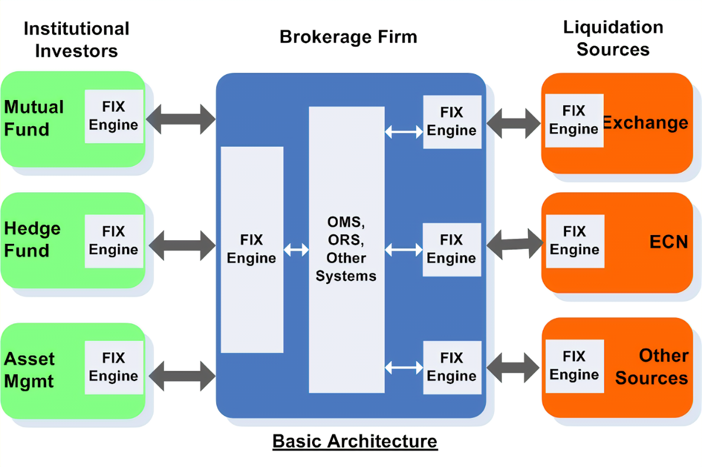

# FIXable
Financial vendors, from exchanges to brokers to participants, use the Financial Information eXchange (FIX) protocol to exchange data. This is an implementation of (some of) the FIX 4.2 standard in C++.



## How it's Built
An overview of the technologies used to build this.

### Architecture
Diagram incoming.

### C++
This project uses C++ 17, mostly because I'm trying to learn C++ right now. It's the language of choice for most financial applications that have to be fast.

### Testing
I use [GoogleTest](https://github.com/google/googletest), as that's the industry standard. The goal is to have tests for every non-trivial function.

### Logging
Logging is obviously important for any project. I use [spdlog](https://github.com/gabime/spdlog) because it's fast and lightweight.

### Code Style
I use [Google's C++ conventions](https://google.github.io/styleguide/cppguide.html) because they are effective at maximizing readiability and minimizing unintended behavior, even if they can be fairly strict.

### Enforcement
Enforcement of style guidelines and testing is mandatory. The main branch is read-only, and to merge something into main, all tests must pass and [clang-format](https://clang.llvm.org/docs/ClangFormat.html) must pass using the Google style guide. This is set up with Github Actions

## Optimizations
Right now, not much is optimal about this setup. I'd like to have concurrency for the whole system in the future. A specific feature that I'd like to implement is buffered input. We should have an input stream buffer, where a TCPServer thread writes packets into the buffer as it receives them. While this happens, a FixParser Thread should be parsing the stream for complete FIX messages.

## Lessons Learned
The project is still in progress, however I've already learned some lessons.

### Set up formatting and testing first
If I had simply set up my pipelines before anything else, I wouldn't have had to refactor my entire project when I finally did set things up.

### Seperate stack layers as best you can
When writing the first draft of this project, I included FIX logic in my TCP Server. This made it very difficult to divore the two, and I ended up having to rewrite both.

## Feature Roadmap
| Feature            | Status      | Tested? |
| :----------------: | :---------: | :-----: |
| Session management | In Progress | No      |
| Server and Client  | Complete    | No      |
| Stream -> Message  | Complete    | No      |
| Repeated Groups    | Not Started | No      |
| Multithreaded Input| Not Started | No      |
| DB Integration     | Not Started | No      |

## Get Started
Note that you'll probably only be able to develop this on unix systems, since we use ```<sockets>```. I assume WSL should have the relevant libraries installed, but I'm not sure.

1. Clone the github
2. Make a branch
3. Create a build directory
4. Cmake (from inside build directory
```
cmake -S .. -B .
```
5. Make (from inside build directory)
```
make
```
6. The Fix Client should be an executable called fix_client.o. The Fix Server should be an executable called fix_server.o. 

## Install as a User
Right now, you just have to install it like a contributor. I'll cook up a docker image for it soon.
